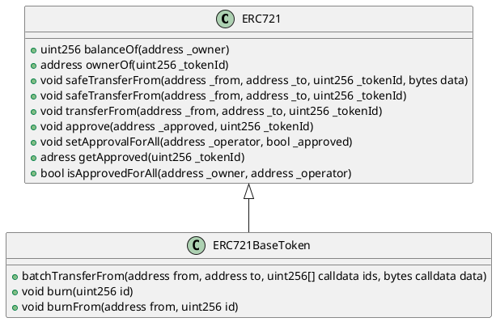

# [Our ERC721 Implementation](https://github.com/thesandboxgame/sandbox-smart-contracts/blob/master/src/solc_0.8/common/BaseWithStorage/ERC721BaseToken.sol)

## Description

This document describes our custom base implementation of an [ERC721](https://ethereum.org/en/developers/docs/standards/tokens/erc-721) compatible smart contract.

This contract is based on ERC721 which deals with Non-Fungible Token (NFT).
A Non-Fungible Token is used to identify something or someone in a unique way.
It could be numbered seats for a concerts. Animatted gif of sport match, etc.

IERC721 provides functionalities like to transfer tokens from one account to another, to get the current token balance of an account
and also the total supply of the token available on the network.
Besides these it also has some other functionalities like to approve that an amount of token from an account can be spent by a third party account.

In our implementation, we had the ability to destroy NFT's with burn and burnFrom method's.
Also had the ability to transfer multiple NFT's from an address to another at same time.

## Class diagram

