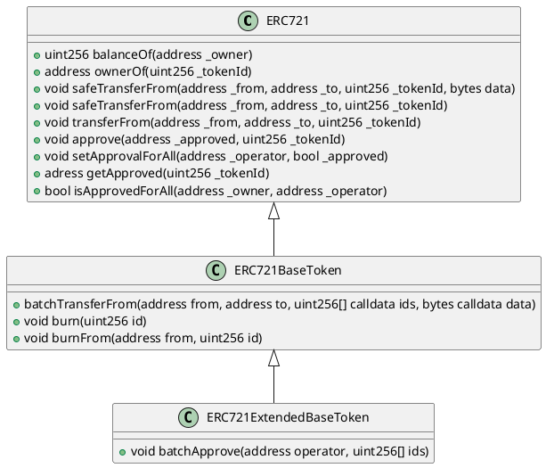
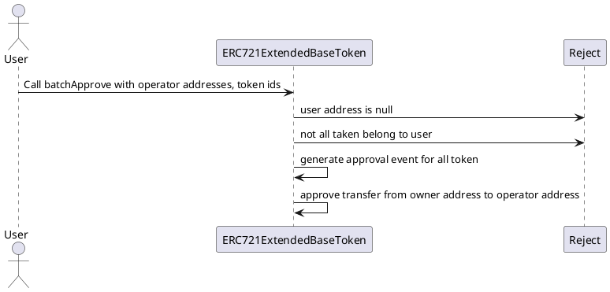

# [ERC-721 Extended](https://github.com/thesandboxgame/sandbox-smart-contracts/blob/master/src/solc_0.8/common/BaseWithStorage/ERC721ExtendedBaseToken.sol)

## Introduction

This contract is an Extension on ERC-721.
It brings a new feature that is missing on ERC-721:
- The ability to approve the transfer of multiple tokens from one address to another.

This standard is used in Sandbox to represents Land and GameToken.


## Participants

- User: The user that approve multiple *ERC-721 token* transfer.
- Operator: The deployer and owner of the contract.

## Process

## Batch approval for ERC-721

### Step 1

Ensure that user address is not null address:
```
  address(0)
```

### Step 2

Ensure that all tokens belongs to user.

### Step 3

Approve transfer for all token from user's address to operator' address.

## Class diagram


## Sequence diagram


